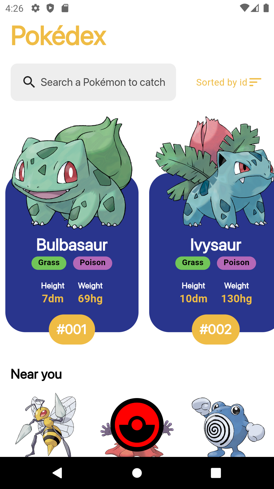
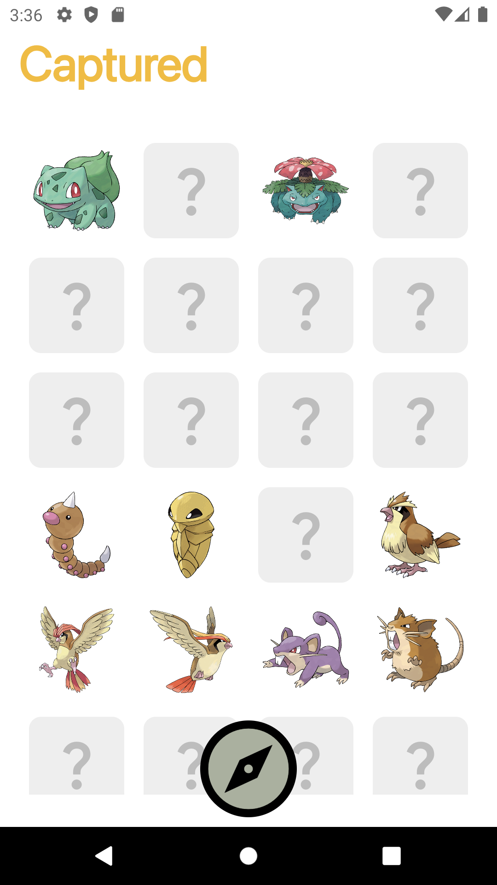
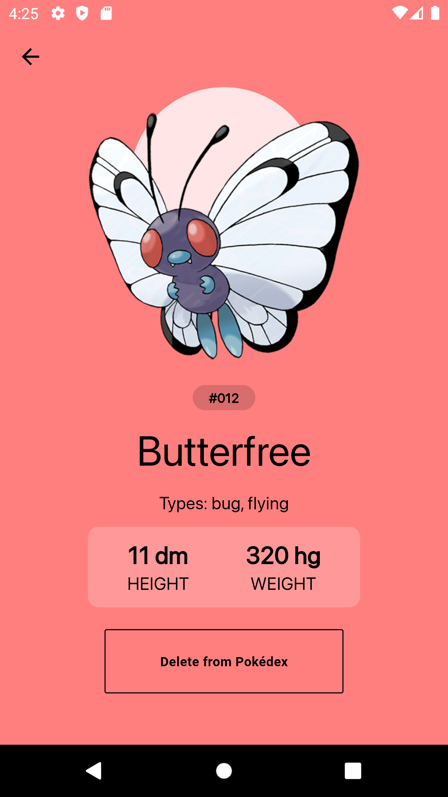
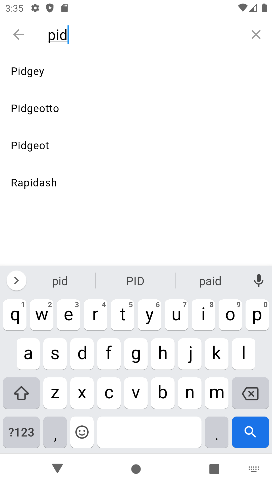
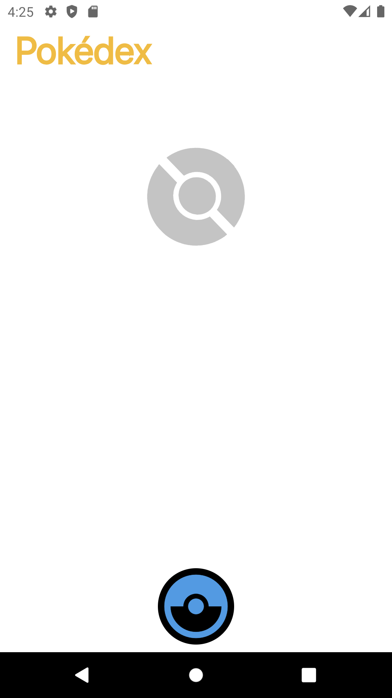
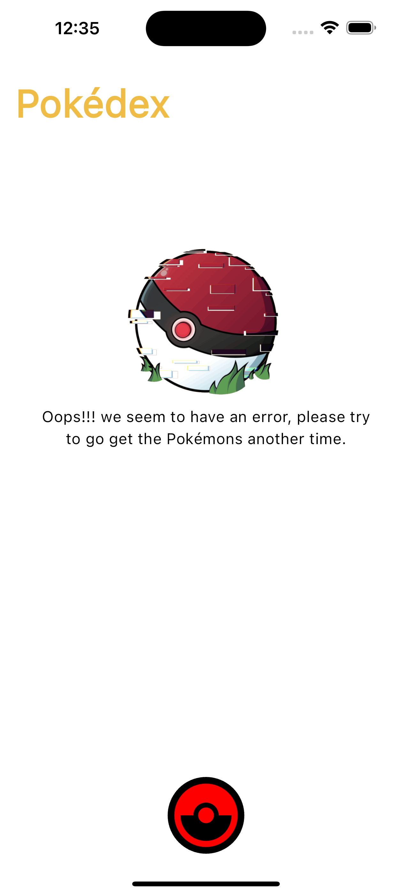
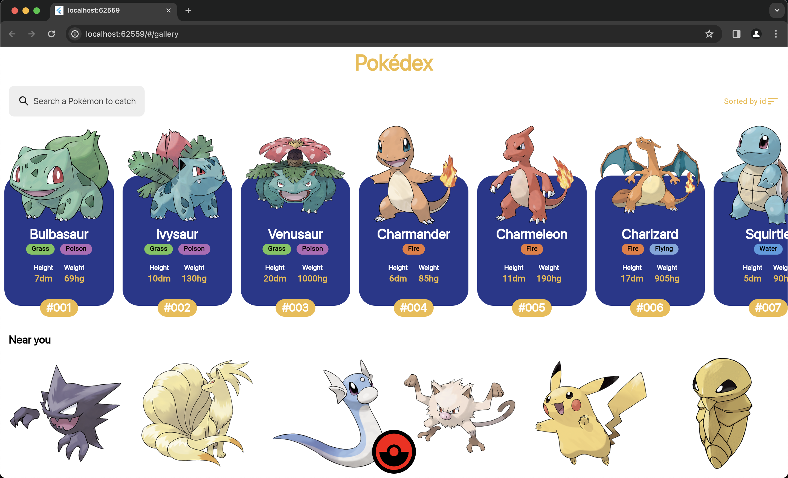
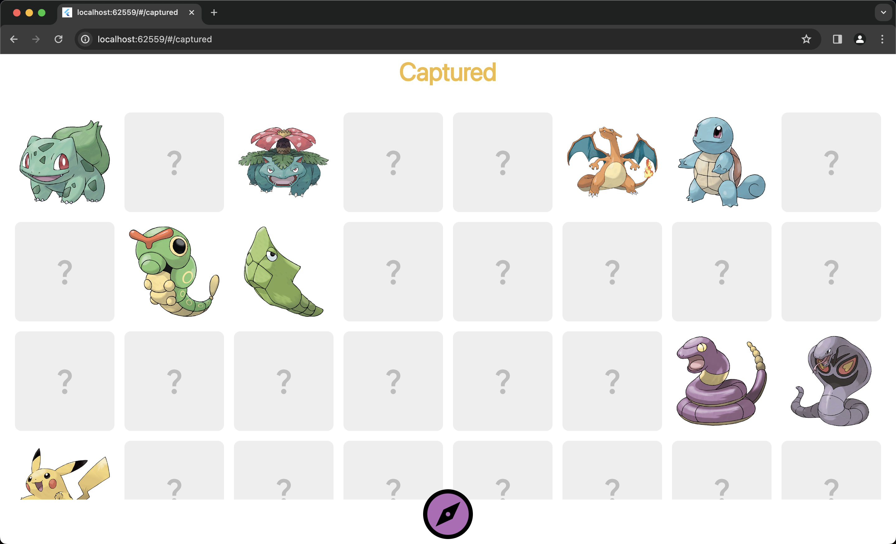
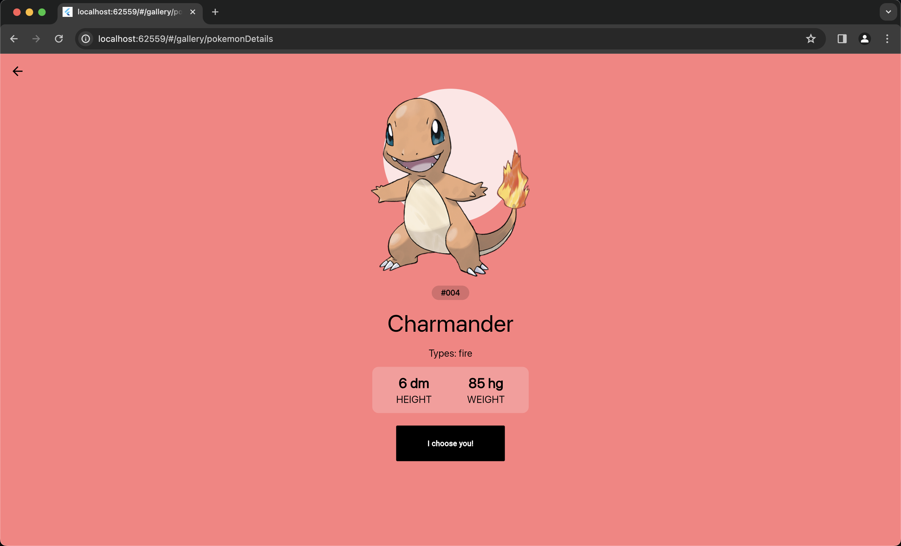

# Pokédex App

Esta es una aplicación de Pokédex desarrollada en Flutter que cumple con los siguientes requisitos:

- Se ha utilizado el paquete `dio` para realizar las llamadas a la API de Pokémon y facilitar su uso.
- Para el enrutamiento de la aplicación, se ha utilizado `go_router`.
- El manejo de estados se ha implementado con `Bloc` y `hydrated_bloc` para guardar el estado.
- Para mejorar la velocidad de renderizado de las imágenes de los Pokémon, se ha utilizado `cached_network_image`.
- Para el manejo del almacenamiento local, se ha utilizado `hive`.
- La aplicación ha sido probada en los dispositivos iPhone 14 Pro Max, Pixel 2 (API 30) y en Google Chrome.

## Cambio de Color del Tema

El cambio de color del tema se ha implementado utilizando `hydrated_bloc`, donde se cambia el color del icono del menú y del fondo de pantalla de la pantalla de detalles del Pokémon. No se ha cambiado el color de la `AppBar` porque no quedaba estéticamente bien.

## Animación del Menú

Se ha añadido una animación al menú para que aparezcan los Pokémon capturados por debajo de la pantalla.

## Widgets de Carga y de Error

Se han añadido widgets de carga y de error para proporcionar una mejor experiencia al usuario en caso de que haya problemas con la carga de datos.

## Capturas de Pantalla

A continuación, se muestran algunas capturas de pantalla de la aplicación:

1. 
2. 
3. 
4. 
5. 
6. 
7. 
8. 
9. 